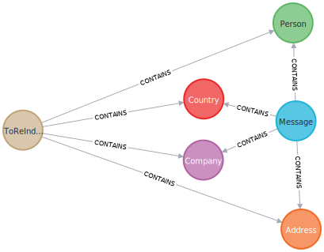
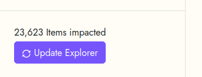
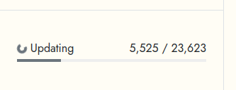
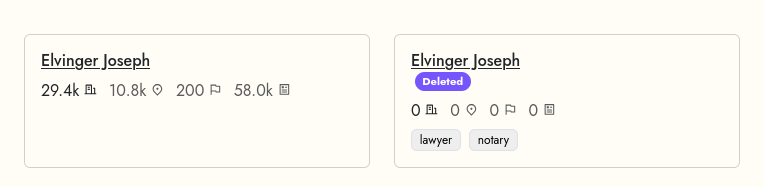

# Letterbox Data Architecture

This page presents the motivations and limitations of the Letterbox data architecture.

## Two databases for two usages

A Neo4J graph database stores the data and support the edition usages.
It's a safe place to store and edit data (transactional database).

Since the data have to edited we need to keep track of the original data model, i.e. the messages citing people, companies, addresses, countries.



An elasticsearch server which serves the explore pages queries.
We need a dedicated search engine for the search usage as we need to precompute the cooccurrence data in order to speed up response time.

The messages are the glue that ties all the data together. Yet it's the largest set of data. Having to go through messages to filter data is very big drawbacks which slows down responses.

Elasticsearch holds 5 indices one by item type + one for messages.
In each index we store the cooccurrences as a nested list of id/name.

The People index mapping

```JSON
{
  "people": {
    "mappings": {
      "properties": {
        "name": {
          "type": "keyword",
          "fields": {
            "text": {
              "type": "text",
              "analyzer": "IndexAnalyzer",
              "search_analyzer": "SearchAnalyzer"
            }
          }
        },
        "content": { "type": "alias", "path": "name.text" },
        "id": { "type": "keyword" },

        "fingerprint": { "type": "keyword" },

        "addresses": { "type": "keyword" },
        "addressesCount": { "type": "long" },

        "companies": { "type": "keyword" },
        "companiesCount": { "type": "long" },

        "countries": { "type": "keyword" },
        "countriesCount": { "type": "long" },

        "messagesCount": { "type": "long" },
        "years": { "type": "integer" },

        "tags": { "type": "keyword" },
        "verified": { "type": "boolean" },
        "deleted": { "type": "boolean" }
      }
    }
  }
}
```

Cooccurrences items (addresses, companies, countries in the people example) are stored as a concatenation of id and label to allow aggregations on homonyms (same labels different ids).

## Sync Data: Edition versus Search

Having two ways to store the data brings synchronization issues.
We could technically update the index after each data edition.
It's usually what we do but in the letterbox contexte that was not an option.

Updating data in the letterbox context implies in most cases to change the citations of items among a set of messages.

> deleting an item means removing it from its messages

> aggregating two items into one common means change reroute original message citations to the newly merged item.

And since what we care about in the project are co-citation, changing one message citation scheme requires to recalculate all cited items cooccurrences metrics.

The amount of data to reindexed grows exponentially.
Moreover successive editions might need to re-index the same items multiple times.

To avoid slowing down data editions, we decoupled edition and indexation in two different steps.

Data editions made in Neo4j flags edited items but does not impact the search engine. The front-end shows to users the number of edited but not indexed data points and propose to start an indexation process.




Till this process is not done, the search engine data state is out of sync. We added a deleted flag on top of the edited one to be able to show in the search results the items which are still in the index but have been deleted in the database.



## Limitations

### Search engine

- we can only store the first 10k cooccurrences (nested size limit in ElasticSearch)
- sort on total number of cooccurrence (not on filtered messages)

## Performance

As stated upper in this document, the main issues regarding performance are linked to the very high cardinality of the data: there are many messages (3,083,906) and very linked.

| People                        | nb_message | Company                             | nb_message | Address                                    | nb_message | Country                | nb_message |
| ----------------------------- | :--------: | ----------------------------------- | :--------: | ------------------------------------------ | :--------: | ---------------------- | :--------: |
| Jean Seckler                  |   334036   | PRICEWATERHOUSE COOPERS             |   23522    | L-2449 Luxembourg, 2 Boulevard Royal       |   138098   | Belgium                |   517934   |
| Henri Hellinckx               |   264922   | CAYMAN ISLAN                        |   10283    | Luxembourg                                 |   89116    | France                 |   109722   |
| Seckler Jean                  |   122331   | Banque Internationale à Luxembourg  |    3111    | GRANDE-DUCHESSE CHARLOTTE                  |   75545    | United Kingdom         |   103364   |
| Elvinger Joseph               |   118961   | MEMORIAL                            |    2859    | Guillaume Kroll                            |   60140    | British Virgin Islands |   91131    |
| Joseph Elvinger               |   118313   | Banque Internationale               |    2673    | 2 Boulevard Royal, L-2449 Luxembourg       |   56167    | Cayman Islands         |   52485    |
| SONT PRÉSENTS                 |   111447   | Compagnie Fiduciaire                |    1657    | GABRIEL LIPPMANN                           |   54943    | Germany                |   49054    |
| Gérard Lecuit                 |   77573    | IMPRIMERIE DE LA COUR VICTOR BUCK   |    1265    | L-1528 Luxembourg, 5 Boulevard de la Foire |   42871    | Panama                 |   48173    |
| GRANDE-DUCHESSE CHARLOTTE     |   75545    | Société Générale                    |    1125    | L-2120 Luxembourg, 16 Allée Marconi        |   40885    | Switzerland            |   46678    |
| André-Jean-Joseph Schwachtgen |   72084    | ############## CHECK IT ########### |    1050    | L-2240 Luxembourg, 37 Rue Notre-Dame,      |   35111    | Italy                  |   42560    |
| Martine Schaeffer             |   69954    | Banque de Bruxelles                 |    975     | Luxembourg, 14, rue Aldringen              |   34199    | Netherlands            |   39574    |

Thus counting requires to walk through a very large number of data point (nodes and relationships).

For the database, we need to provide enough RAM to its page cache so that it can read data very quickly directly from the cache without having to go back and forth from the disk. We recommend 20Go for the Luxembourg dataset.
The second parameter is the Heap which is less sensitive for performance. It's recommended to allow it 4Go to handle large payload of data streams when importing.

The elasticsearch engine behaves correctly with 4Go of Heap.

## Future challenges

### Multiple datasets

Two different approach for this.

Either allocate one very performant server to host all datasets in one instance.

| Pro                                       | Cons                              |
| ----------------------------------------- | --------------------------------- |
| same items like people/companies directly | need a dataset flag to scope data |
| mutualize ressources                      | only one indexation queue for all |

Or create one instance by dataset and link items to a common reference.

| Pro            | Cons                             |
| -------------- | -------------------------------- |
| isolated usage | isolated data                    |
|                | need to add the data ref feature |

### Multiple users

In principle the current database can handle concurrent access by design.
Having multiple users editing data on the same dataset should not be an issue.

- requires to develop user accounts + auth
- we need to define data edition workflow and traceability
- might need to work on some LOCK issues
- might need to rise the HEAP memory (larger batch of data to index)

### Create a read-only exploration tool

Better performance, easier to archive/publish.
